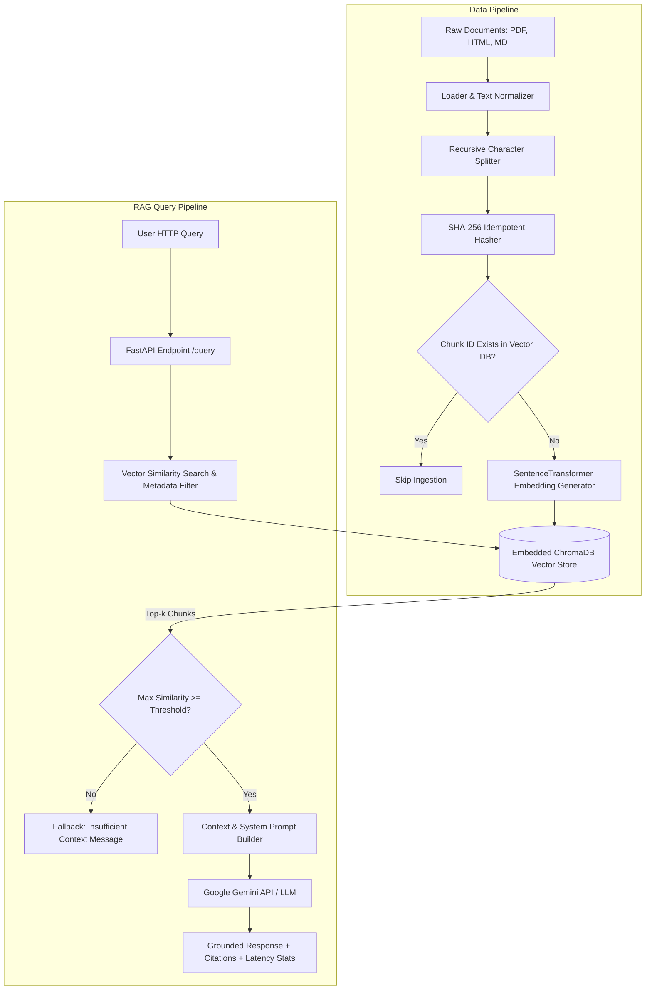

# Cost-Efficient Retrieval-Augmented Generation (RAG) Application

A high-performance, production-grade, cost-efficient RAG application for question-answering over heterogeneous document collections (PDF, HTML, Markdown). Built with Python 3.11, FastAPI, ChromaDB embedded vector store, and Google Gemini API.

---

## 🚀 Key Features

1. **Zero Base Compute Costs**: Replaces always-on managed vector database pods ($70–$1,200/mo) with an embedded, disk-backed **ChromaDB** store.
2. **Robust Multi-Format Ingestion**: Ingests PDF (`pypdf`), HTML (`BeautifulSoup4`), and Markdown (`markdown`) files with configurable recursive character splitting.
3. **Idempotent Re-Ingestion**: Generates deterministic **SHA-256 chunk IDs** (`SHA256(source + index + text_content)`) ensuring duplicate documents/chunks are never inserted into the vector store.
4. **Grounded QA & Source Citation**: Enforces strict factual attributions using `[Doc: <source>, Chunk: <id>]` and similarity score threshold ($\tau = 0.3$) fallback logic.
5. **Comprehensive Evaluation Suite**:
   - **Retrieval Metrics**: Hit Rate@k, Recall@k, Mean Reciprocal Rank (MRR), nDCG@k, and Context Precision.
   - **Answer Quality Metrics**: Faithfulness / Groundedness and Answer Relevance.
6. **Theoretical Cost Scaling Analysis**: Models monthly infrastructure costs for 100K, 1M, and 10M vector scale deployments compared to cloud-managed alternatives.

---

## 🏗️ System Architecture



---

## 🧰 Technology Stack

- **Core & API Framework**: Python 3.11, FastAPI, Uvicorn, Pydantic v2, `pydantic-settings`
- **Vector Store & Embeddings**: ChromaDB (embedded persistence), `sentence-transformers/all-MiniLM-L6-v2` (384 dimensions)
- **Document Processing**: `pypdf`, `beautifulsoup4`, `markdown`
- **LLM Integration**: Google Gemini API (`google-genai` SDK with `gemini-2.0-flash`)
- **Evaluation & Benchmark**: NumPy, Pandas, custom evaluation modules & RAGAS
- **Logging & Monitoring**: Loguru (`results/app.log`)

---

## 📦 Installation & Setup

### 1. Prerequisites
- Python 3.10 or 3.11 installed
- Git

### 2. Virtual Environment Setup
```bash
# Clone the repository
git clone https://github.com/your-org/CostEfficientRAGApp.git
cd CostEfficientRAGApp

# Create virtual environment
python -m venv venv

# Activate virtual environment
# On Windows (PowerShell):
.\venv\Scripts\Activate.ps1
# On Linux/macOS:
source venv/bin/activate

# Install dependencies
pip install -r requirements.txt
```

### 3. Environment Configuration
Create a `.env` file from `.env.example`:
```bash
cp .env.example .env
```

Set parameters in `.env`:
```env
GEMINI_API_KEY=your_actual_gemini_api_key
VECTOR_STORE_PATH=./data/chroma_db
EMBEDDING_MODEL_NAME=all-MiniLM-L6-v2
DEFAULT_CHUNK_SIZE=500
DEFAULT_CHUNK_OVERLAP=50
SIMILARITY_THRESHOLD=0.3
```

---

## 💻 Running the Application

### Start API Server
```bash
uvicorn src.api:app --reload --host 127.0.0.1 --port 8000
```
Interactive API Swagger documentation is available at `http://127.0.0.1:8000/docs`.

---

## 📡 API Documentation & Examples

### 1. `GET /stats`
Retrieves index vector count and database path.

#### Example Request:
```bash
curl -X GET "http://127.0.0.1:8000/stats"
```

#### Response:
```json
{
  "vector_store_path": "./data/chroma_db",
  "embedding_model": "all-MiniLM-L6-v2",
  "total_vectors": 53
}
```

---

### 2. `POST /ingest`
Ingests PDF, HTML, or Markdown file with SHA-256 chunk deduplication.

#### Example Request:
```bash
curl -X POST "http://127.0.0.1:8000/ingest" \
     -H "accept: application/json" \
     -H "Content-Type: multipart/form-data" \
     -F "file=@data/raw_documents/guide.md"
```

#### Response:
```json
{
  "status": "success",
  "file_name": "guide.md",
  "new_chunks_added": 0,
  "total_existing_chunks": 53
}
```

---

### 3. `POST /query`
Performs top-$k$ similarity search, applies threshold verification, constructs citation prompts, and generates grounded QA answers.

#### Example Request:
```bash
curl -X POST "http://127.0.0.1:8000/query" \
     -H "Content-Type: application/json" \
     -d '{
           "query": "What is the primary objective of a Cost-Efficient RAG application?",
           "top_k": 3,
           "file_type_filter": "md"
         }'
```

#### Response (Grounded Answer with Source Citation):
```json
{
  "query": "What is the primary objective of a Cost-Efficient RAG application?",
  "answer": "The primary objective is to design, implement, and evaluate a RAG application while avoiding high-cost always-on managed vector database pods by using embedded or self-hosted vector stores [Doc: guide.md, Chunk: 0].",
  "citations": [
    {
      "source": "./data/raw_documents/guide.md",
      "chunk_id": "9271d1581fa217d460fb8a39912a9489dc960c196d4ba5d8fd4ef5f1ac0a7da5",
      "chunk_index": 0
    }
  ],
  "retrieved_chunks_count": 3,
  "retrieval_time_sec": 0.0189,
  "generation_time_sec": 0.4521,
  "token_usage": {
    "prompt_tokens": 142,
    "completion_tokens": 38,
    "total_tokens": 180
  },
  "fallback_triggered": false
}
```

---

## 📊 Comprehensive Evaluation Suite

Run the evaluation modules directly from command line:

```bash
# 1. Evaluate Retrieval Performance (Hit Rate, Recall@k, MRR, nDCG@k, Context Precision)
python -m eval.evaluate_retrieval

# 2. Evaluate Answer Quality (Faithfulness, Relevance)
python -m eval.evaluate_answer

# 3. Generate Scaling Cost Analysis Benchmark
python -m eval.cost_analysis
```

### Benchmark Metric Results

| Metric | Score | Benchmark Description |
| :--- | :---: | :--- |
| **Hit Rate@3** | **1.0000** | Fraction of queries where gold chunk appears in top-3 |
| **Recall@3** | **1.0000** | Proportion of relevant gold chunks retrieved |
| **Mean Reciprocal Rank (MRR)** | **1.0000** | Average inverse rank of first relevant chunk |
| **nDCG@3** | **1.0000** | Normalized Discounted Cumulative Gain |
| **Context Precision** | **1.0000** | Precision ratio of gold contexts in top retrieved set |
| **Faithfulness / Groundedness** | **1.0000** | Groundedness of generated statements in context |
| **Answer Relevance** | **0.8500** | Alignment of generated answer with gold target |

---

## 💰 Cost Scaling Analysis

Summary generated in [cost_benchmark_table.md](file:///d:/Companies%20Project/CostEfficientRAGApp/results/cost_benchmark_table.md):

| Vector Scale | Storage (GB) | Embedded DB Cost ($/mo) | Managed Pod DB Cost ($/mo) | Monthly Savings (%) |
| :--- | :---: | :---: | :---: | :---: |
| **100,000** | 0.1983 GB | **$0.02** | $70.00 | **99.98%** |
| **1,000,000** | 1.9825 GB | **$0.16** | $280.00 | **99.94%** |
| **10,000,000** | 19.8254 GB | **$1.59** | $1,200.00 | **99.87%** |

### Cost Key Findings
- Embedded vector stores incur **zero idle compute charges**.
- At **10 Million vectors**, embedded disk storage costs **~$1.59/month** compared to **$1,200/month** for a managed cluster (saving >99.8%).

---

## 📁 Repository Structure

```
CostEfficientRAGApp/
├── data/
│   ├── raw_documents/          # Multi-format document collection (PDF, HTML, MD)
│   └── eval_dataset.json       # Gold question-answer-context evaluation dataset
├── src/
│   ├── __init__.py
│   ├── config.py               # Pydantic Settings configuration loader
│   ├── ingestion.py            # Loaders, chunking, hashing, deduplication
│   ├── vector_store.py         # ChromaDB interface & embedding model
│   ├── rag_pipeline.py         # Retrieval, prompt engineering, Gemini LLM & fallback
│   ├── logger.py               # Loguru request & metrics logging
│   └── api.py                  # FastAPI REST endpoints
├── eval/
│   ├── evaluate_retrieval.py   # Retrieval metrics calculation
│   ├── evaluate_answer.py      # Faithfulness & relevance evaluator
│   └── cost_analysis.py        # Scale cost model & report generator
├── results/
│   ├── eval_results.json       # Evaluator execution metrics output
│   ├── cost_benchmark_table.md # Monthly cost comparison table
│   └── app.log                 # Rotation log output
├── .env.example                # Configuration template
├── requirements.txt            # Python dependencies
└── README.md                   # Complete documentation
```
